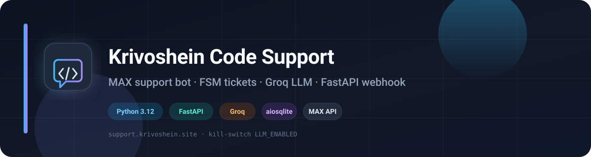
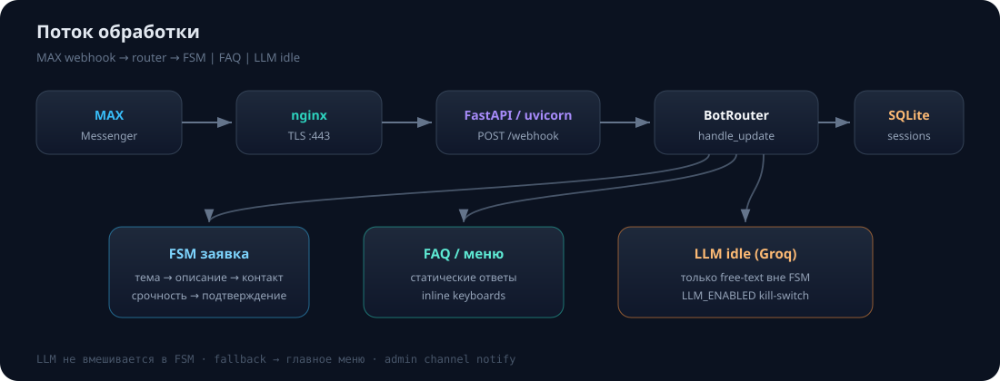

<p align="center">
  
</p>

<p align="center">
  <strong>Бот поддержки ИП Кривошеин А.С.</strong> в мессенджере
  <a href="https://max.ru">MAX</a>
  — FAQ, свободный диалог (LLM), структурированные заявки.
</p>

<p align="center">
  
  
  
  
  
</p>

<p align="center">
  <a href="https://krivoshein.site">krivoshein.site</a> ·
  <a href="https://support.krivoshein.site">support.krivoshein.site</a> ·
  <a href="https://wordpress.krivoshein.site">WordPress</a> ·
  <a href="https://vps.krivoshein.site">VPS</a> ·
  <a href="https://bots.krivoshein.site">Боты</a> ·
  <a href="https://direct.krivoshein.site">Директ</a>
</p>

---

## Возможности

| | |
|:--|:--|
| **Главное меню** | Заявка · FAQ · Документация · Другое |
| **FSM заявок** | Тема → описание (+скриншоты) → контакт → срочность → подтверждение |
| **LLM idle-chat** | Свободные вопросы по услугам (Groq), kill-switch `LLM_ENABLED` |
| **Админ-канал** | Текст заявки + пересылка изображений |
| **Безопасность** | `X-Max-Bot-Api-Secret`, без секретов в коде |

### Темы заявки

| Тема | Payload |
|:-----|:--------|
| WordPress / Поддержка сайта | `ticket:topic:wordpress` |
| VPS / Серверы | `ticket:topic:vps` |
| Боты (MAX / Telegram) | `ticket:topic:bots` |
| Яндекс.Директ | `ticket:topic:direct` |
| Лендинги / Сайты под ключ | `ticket:topic:landing` |
| Другое | `ticket:topic:other` |

Старые payload (`support` / `website` / `ads`) по-прежнему принимаются для совместимости.

---

## Архитектура

<p align="center">
  
</p>

```
MAX → HTTPS → nginx → uvicorn :8080  POST /webhook
  → verify X-Max-Bot-Api-Secret
  → BotRouter.handle_update
       ├─ active FSM?  → ticket handlers (без LLM)
       ├─ menu / FAQ   → keyboards + static texts
       └─ idle text    → LlmService (если LLM_ENABLED) → fallback меню
```

| Модуль | Роль |
|:-------|:-----|
| `app/webhook.py` | FastAPI lifespan, health, webhook |
| `app/bot/router.py` | Маршрутизация апдейтов, FSM, idle+LLM |
| `app/bot/keyboards.py` | Inline-кнопки MAX |
| `app/tickets/*` | Draft, SQLite, media, notify admin |
| `app/max_api/*` | httpx-клиент platform-api |
| `app/llm/*` | Groq client, system prompt, service |

---

## Стек

- **Python 3.12** · FastAPI · Uvicorn
- **httpx** — MAX API + Groq (OpenAI-compatible)
- **aiosqlite** — сессии заявок
- **pydantic-settings** — конфиг из `.env`

---

## Быстрый старт

```bash
git clone git@github.com:A-Krivoshen/krivoshein-code-support.git
cd krivoshein-code-support
python -m venv .venv
source .venv/bin/activate
pip install -r requirements.txt
cp .env.example .env   # заполнить токены
```

### Переменные окружения

| Переменная | Описание |
|:-----------|:---------|
| `MAX_BOT_TOKEN` | Токен бота MAX (**обязательно**) |
| `WEBHOOK_SECRET` | Секрет webhook, 5–256: `A-Z a-z 0-9 _ -` |
| `WEBHOOK_URL` | Публичный HTTPS URL (по умолчанию support.krivoshein.site) |
| `ADMIN_CHANNEL_ID` | Канал для заявок |
| `LLM_ENABLED` | Kill-switch LLM (`false` по умолчанию) |
| `LLM_API_KEY` | Ключ Groq |
| `LLM_BASE_URL` | `https://api.groq.com/openai/v1` |
| `LLM_MODEL` | `llama-3.3-70b-versatile` |
| `LLM_TIMEOUT` / `LLM_MAX_TOKENS` / `LLM_TEMPERATURE` | Лимиты ответа |

Секрет для разработки:

```bash
python -c "import secrets; print(secrets.token_urlsafe(32))"
```

### Запуск

```bash
# Проверка MAX API
python -m app.main

# Webhook
uvicorn app.webhook:app --host 127.0.0.1 --port 8080

# Регистрация webhook в MAX (после деплоя / смены secret)
python -m scripts.register_webhook
```

### Тесты

```bash
pip install -r requirements-dev.txt
MAX_BOT_TOKEN=test-token WEBHOOK_SECRET=test_secret_12345 pytest
```

---

## Деплой (systemd)

Пример юнита: `app/webhook.service.example`.

```bash
sudo systemctl restart krivoshein-code-support
sudo systemctl status krivoshein-code-support --no-pager
journalctl -u krivoshein-code-support -n 50 --no-pager
```

- Публичный URL — **HTTPS :443** (nginx → uvicorn).
- `EnvironmentFile` указывает на `.env` (секреты **не** в git).
- LLM: сначала `LLM_ENABLED=false`, после smoke → `true`.

---

## Поведение LLM

1. Вызывается **только** в idle (нет FSM, не reset, не label меню).
2. Успех → ответ + кнопки «Подать заявку / FAQ / В меню».
3. Ошибка / таймаут / выключено → fallback + главное меню.
4. Внутри FSM LLM **не** участвует; на «не том» шаге — мягкая подсказка + клавиатура.

---

## Структура

```
app/
  bot/          # router, FSM states, FAQ, keyboards, texts
  llm/          # Groq client, prompts, service
  max_api/      # HTTP client MAX
  tickets/      # models, storage, media, admin notify
  webhook.py    # FastAPI entry
  config.py     # settings
docs/
  banner.svg
  architecture.svg
scripts/
  register_webhook.py
tests/
```

---

## Лицензия и контакты

Проект для ИП **Кривошеин А.С.**  
Сайт: [krivoshein.site](https://krivoshein.site) · контакты: [krivoshein.site/contacts](https://krivoshein.site/contacts/)
